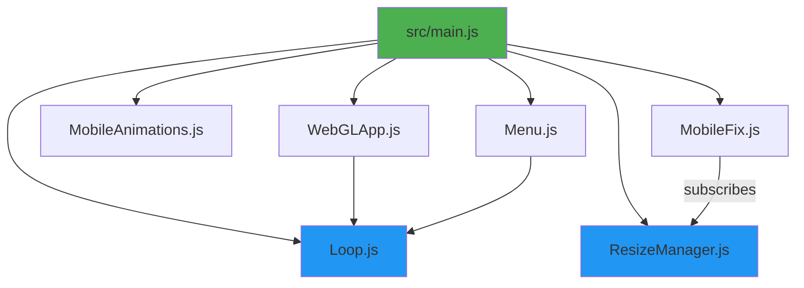

# 🔍 Deep Code Audit: portfolio-webgl-google

> **Purpose**: Reference document for AI agent to understand the codebase structure, patterns, and known issues before refactoring.

---

## 📁 Project Structure Overview

```
portfolio-webgl-google/
├── index.html           # Home page (~1500 lines, 54KB)
├── index.backup.html    # Backup of index page
├── pages/
│   ├── about.html       # About page (~1500 lines, 52KB)
│   ├── contact.html     # Contact page (~1400 lines, 51KB)
│   ├── credits.html     # Credits page (~1000 lines, 37KB)
│   └── work.html        # Work/Projects page (~1400 lines, 49KB)
├── css/
│   └── style.css        # Webflow-generated CSS (~8400 lines, 139KB)
├── src/                 # ES Modules (modern architecture)
│   ├── main.js          # App entry point (137 lines)
│   ├── core/
│   │   ├── Loop.js           # RAF singleton (79 lines)
│   │   ├── ResizeManager.js  # Debounced resize pub-sub (56 lines)
│   │   ├── ScrollManager.js  # Virtual scroll system (282 lines)
│   │   ├── MobileFix.js      # Mobile horizontal scroll + fixes (402 lines)
│   │   └── MobileAnimations.js # IntersectionObserver animations (285 lines)
│   ├── ui/
│   │   └── Menu.js           # Burger menu canvas logic (337 lines)
│   └── webgl/
│       └── WebGLApp.js       # Three.js sphere + shaders (443 lines)
├── javascript/          # Legacy code (external scripts)
│   ├── cursor/
│   │   └── index.js     # Custom cursor (7.6KB)
│   └── webglball/
│       ├── index.js     # Legacy WebGL sphere (7.8KB)
│       └── shaders.js   # GLSL shaders (8.3KB)
└── docs/
    └── README.md        # Basic project description
```

---

## ⚠️ Critical Architecture Issue: Dual Systems

The codebase has **TWO parallel animation/logic systems** that can conflict:

### 1. Inline Scripts in HTML (Legacy)
Every HTML page contains nearly **identical** inline `<script>` blocks:
- RAFClass - Animation loop (~40 lines, duplicated 5×)
- SoundToggler - Audio wave canvas (~150 lines, duplicated 5×)
- SoundReactor - Web Audio API (~40 lines, duplicated 5×)
- burgerInit() - Burger menu canvas (~300 lines, duplicated 5×)

**Total duplication: ~500+ lines × 5 pages = ~2500 lines of duplicate code**

### 2. ES Modules in `/src/` (New)
Modern modular architecture loaded via:
```html
<script type="module" src="./src/main.js"></script>
```

---

## 🔑 Critical Variables & Patterns

### Global State Variables

| Variable | Location | Purpose |
|----------|----------|---------|
| `window.isMobile` | Inline `<script>` in each HTML | Mobile detection via User-Agent |
| `window.isMobileDevice` | `src/main.js` | Same purpose, set by ES module |
| `window.isSafari` | Inline `<script>` in each HTML | Safari browser detection |
| `RAF` | Inline `<script>` in each HTML | Legacy animation loop instance |
| `soundReactor` | Inline `<script>` in each HTML | Audio manager instance |
| `dpi` | Inline `<script>` (burger section) | `window.devicePixelRatio` cache |

### Critical Resize Fix: B Variable
```javascript
// In burgerInit() inline script, line ~1235
let B = 2e3; // = 2000, tracks distance from burger button

// In resize handler, line ~1315
(B = 2e3); // CRITICAL: Reset to fix hover detection after resize
```
> **Without this reset**, menu hover animations break after window resize.

---

## 📄 Page-by-Page Analysis

### index.html (Home)
- **Lines**: ~1472
- **Unique Features**: 
  - Loading animation (`.load`, `.l-grid`)
  - Hero section with SVG letters
  - WebGL sphere container (`.webglholder`) - **NOT PRESENT** (only on work.html)
  - Sound toggler visible
- **Inline Scripts**: RAFClass, SoundToggler, SoundReactor, burgerInit, CustomCursor
- **ES Module**: `src/main.js`

### pages/work.html (Projects)
- **Lines**: ~1419
- **Unique Features**:
  - Horizontal scroll gallery (`.sidescrollbox` > `.scroller`)
  - 7 project cards (`.p-col`)
  - **NO** WebGL sphere on this page
- **Critical Elements**:
  - `.sidescrollbox` - Viewport wrapper
  - `.scroller` / `.p-grid` - Horizontal strip
  - `.p-numb` - Large project numbers (1-7)

### pages/about.html (About)
- **Lines**: ~1515
- **Unique Features**:
  - Locomotive Scroll integration
  - Profile image section
  - Skills/bio text
- **Known Issues**:
  - Animations don't re-trigger after resize
  - Webflow IX2 animations conflict with scroll

### pages/contact.html (Contact)
- **Lines**: ~1400
- **Unique Features**:
  - Contact form elements
  - Social links

### pages/credits.html (Credits)
- **Lines**: ~1000
- **Unique Features**:
  - Attribution list
  - Darker background

---

## 🎨 CSS Architecture

### css/style.css
- **Lines**: ~8374
- **Origin**: Webflow export (minified structure)
- **Includes**:
  - Webflow base styles (lines 1-400)
  - Grid/layout utilities
  - Component styles (.menu, .burger, .hero, etc.)
  - Locomotive scroll overrides
  - Mobile responsive breakpoints

### Key CSS Classes

| Class | Purpose |
|-------|---------|
| `.burgercontainer` | Burger menu canvas wrapper |
| `.burgerclickablein`, `.burgerclickableout` | Click areas for burger |
| `.nav-trigger` | Menu trigger wrapper |
| `.sidescrollbox` | Work page horizontal scroll container |
| `.scroller`, `.p-grid` | Horizontal scroll track |
| `.webglholder` | Three.js canvas container |
| `.rotate` | "Rotate device" overlay |
| `.cursorcontainer` | Custom cursor canvas wrapper |
| `.soundtoggler` | Audio button wrapper |

---

## 🔄 Module Dependencies



---

## 🐛 Known Bug Patterns

### 1. Resize Hover Detection
**Location**: `burgerInit()` in all HTML files
```javascript
// Bug: After resize, B still holds old distance, breaking hover logic
// Fix: Reset B = 2000 in resize handler
```

### 2. Animation Re-initialization
**Location**: About page, Webflow IX2 animations
```javascript
// Bug: Webflow animations don't re-trigger after resize
// Known: Animations only fire once on initial load
```

### 3. Desktop Scroll at Narrow Widths
**Location**: `src/main.js` lines 39-83
```javascript
// Fix: Forces sidescrollbox layout when desktop at narrow width
// CSS media queries would switch to mobile layout, breaking scroll
```

### 4. Mobile Detection Inconsistency
**Location**: Multiple files
```javascript
// Inline: window.isMobile (set once on load)
// ES Module: window.isMobileDevice (set by main.js)
// Both should be checked for mobile-specific logic
```

---

## 📊 Code Metrics Summary

| Category | Files | Lines | Bytes |
|----------|-------|-------|-------|
| HTML Pages | 5 (+1 backup) | ~7200 | ~243KB |
| CSS | 1 | ~8400 | ~139KB |
| ES Modules | 8 | ~2000 | ~70KB |
| Legacy JS | 3 | ~700 | ~24KB |
| **Total** | **17** | **~18300** | **~476KB** |

---

## 🎯 Refactoring Priorities

### High Priority (Duplicate Code)
1. Extract `RAFClass` → Already done in `src/core/Loop.js` but inline version still runs
2. Extract `SoundToggler` → Create `src/audio/SoundToggler.js`
3. Extract `SoundReactor` → Create `src/audio/SoundReactor.js`
4. Extract `burgerInit` → Already partially in `src/ui/Menu.js`, but inline version still runs

### Medium Priority (Consistency)
1. Unify mobile detection: Use only `window.isMobile` everywhere
2. Centralize resize handling: Use only `ResizeManager`
3. Remove duplicate CSS in inline `<style>` blocks

### Low Priority (Cleanup)
1. Remove unused legacy files if confirmed not needed
2. Minify production CSS
3. Update CDN dependencies

---

## 📝 Notes for Future Agent

1. **Before editing HTML**: Check if the inline script you're modifying is duplicated in other pages
2. **Before touching work.html**: The horizontal scroll has both CSS and JS implementations; test both mobile and desktop
3. **When fixing resize bugs**: Always reset `B = 2000` in resize handlers
4. **Mobile vs Desktop**: Check `window.isMobile` before applying animations
5. **WebGL Sphere**: Only exists in certain routes; check for `.webglholder` before initializing

## Development & Usage

Since this is a static site without a build system (no `package.json` or bundler):

1.  **Running the Project:**
    *   You need a local static file server to run this project (due to ES module CORS policies).
    *   **VS Code:** Use the "Live Server" extension.
    *   **Python:** Run `python -m http.server` in the root directory.
    *   **Node:** Run `npx serve .`

2.  **Dependencies:**
    *   All external libraries are loaded via CDN links in the `<head>` of `index.html`. No `npm install` is required.

3.  **Making Changes:**
    *   **Logic:** Edit files in `src/` for core functionality.
    *   **Styles:** Edit `css/style.css`.
    *   **Content:** Edit `index.html` or files in `pages/`.

---

*Last updated: 2025-12-31*
